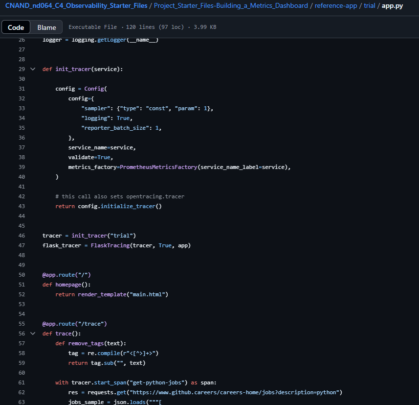

**Note:** For the screenshots, you can store all of your answer images in the `answer-img` directory.

## Verify the monitoring installation

*TODO:* run `kubectl` command to show the running pods and services for all components. Take a screenshot of the output and include it here to verify the installation

## Setup the Jaeger and Prometheus source
*TODO:* Expose Grafana to the internet and then setup Prometheus as a data source. Provide a screenshot of the home page after logging into Grafana.

## Create a Basic Dashboard
*TODO:* Create a dashboard in Grafana that shows Prometheus as a source. Take a screenshot and include it here.

## Describe SLO/SLI
*TODO:* Describe, in your own words, what the SLIs are, based on an SLO of *monthly uptime* and *request response time*.

--> SLI for *monthly uptime*: 
* The website had an availability of 99,9% last month.
* The error rate was below 0,1% last month.
  
SLI for *request response time*: 
* The response time was lower than 300ms avg last month.

## Creating SLI metrics.
*TODO:* It is important to know why we want to measure certain metrics for our customer. Describe in detail 5 metrics to measure these SLIs. 

--> SLI availability: 
* Active pods per service. If there is not at least 1 pod per service the app is not available.
  
SLI error rate:
* Number of requests with status 5xx. The error rate lowers the availability also.
* Number of requests with status 4xx. The error rate lowers the availability also.
  
SLI response time:
* Response time of requests for backend service. If the response time is too high (>300 ms avg) the customer has to wait to long using the app.
* Response time of requests for trail service. If the response time is too high (>300 ms avg) the customer has to wait to long using the trial function of the app.

## Create a Dashboard to measure our SLIs
*TODO:* Create a dashboard to measure the uptime of the frontend and backend services We will also want to measure to measure 40x and 50x errors. Create a dashboard that show these values over a 24 hour period and take a screenshot.

## Tracing our Flask App
*TODO:*  We will create a Jaeger span to measure the processes on the backend. Once you fill in the span, provide a screenshot of it here. Also provide a (screenshot) sample Python file containing a trace and span code used to perform Jaeger traces on the backend service.

## Jaeger in Dashboards
*TODO:* Now that the trace is running, let's add the metric to our current Grafana dashboard. Once this is completed, provide a screenshot of it here.

## Report Error
*TODO:* Using the template below, write a trouble ticket for the developers, to explain the errors that you are seeing (400, 500, latency) and to let them know the file that is causing the issue also include a screenshot of the tracer span to demonstrate how we can user a tracer to locate errors easily.

TROUBLE TICKET

Name: Kai Niggemann

Date: 2025/06/10

Subject: Error when loading the homepage of the trail app

Affected Area: Trial services

Severity: 1

Description: When loading homepage (\ root) the application is returning a "500 Internal server error". See span 3a6b98f for further details.
Expected result: main page is shown.

## Creating SLIs and SLOs
*TODO:* We want to create an SLO guaranteeing that our application has a 99.95% uptime per month. Name four SLIs that you would use to measure the success of this SLO.

-->
* The frontend service is active and running during 99.975% per month.
* The backend service is active and running during 99.975% per month.
* The error rate is below 0,001% per month.
* The response time is lower than 3 s for 99.95% of requests last month.

## Building KPIs for our plan
*TODO*: Now that we have our SLIs and SLOs, create a list of 2-3 KPIs to accurately measure these metrics as well as a description of why those KPIs were chosen. We will make a dashboard for this, but first write them down here.

-->
1. Active pods per service. If there is not at least 1 pod per service the app is not available.
2. Number of requests with status 5xx. The error rate lowers the availability also.
3. Response time of requests for backend services. If the response time is too high (>3 s avg) the customer has to wait to long using the app. The app is not usable with this big response time --> app is not available.

## Final Dashboard
*TODO*: Create a Dashboard containing graphs that capture all the metrics of your KPIs and adequately representing your SLIs and SLOs. Include a screenshot of the dashboard here, and write a text description of what graphs are represented in the dashboard.

-->
* For 1. metric the panel "Active pods" is measuring the availabity of the services.
* For 2. metric the panel "Request status" is measuring the backend requests with 5xx error status.
* For 3. metric the panel "Request duration" is measuring the duration of the backend requests.

